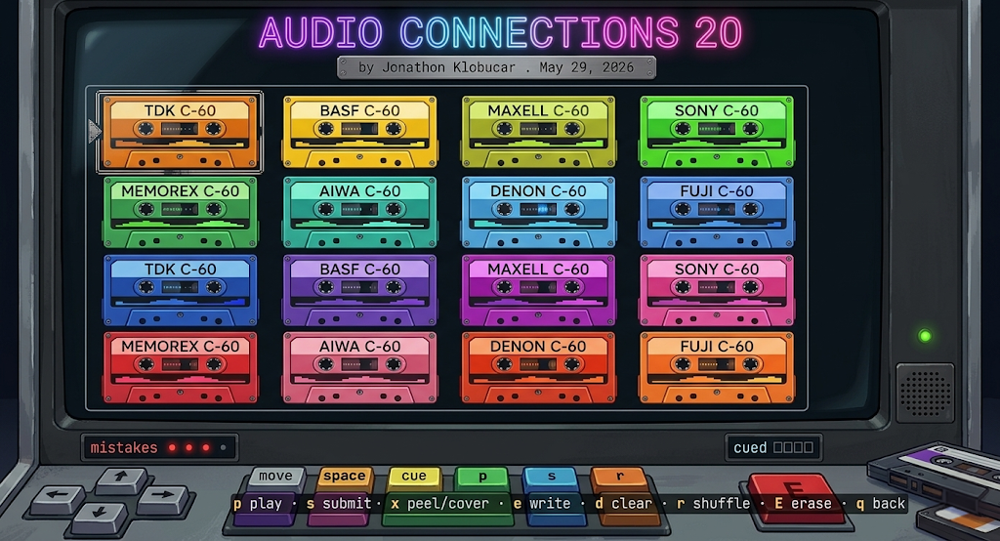

# ac-term



A terminal build of [Audio Connections](https://connections.audio) — the daily
"group sixteen songs into four hidden groups of four" puzzle — rendered with
[Bubbletea](https://github.com/charmbracelet/bubbletea) and a cassette-deck
color scheme. Same game, with a pop of color and the tape-reel vibe.

Like the web game, you don't see the song titles — you cue a track, *listen*,
and group the sixteen by ear. The terminal version just wears it as a cassette
deck: tapes deal in with their labels peeled off, you peek one back on if you're
stuck, and scribble your own label on any tape.

## Install

```sh
go install github.com/klobucar/ac-term@latest   # needs Go 1.25+
```

Or build from a clone:

```sh
make build && ./ac-term     # embeds the live feed for an offline floor
go build -o ac-term .       # bare build: empty embed, fetches the feed at runtime
```

The puzzle data isn't committed — `make build`/`make run`/`make data` download it
into the (gitignored) embed; a plain `go build` ships with no embed and just
fetches on launch (needs a network connection on first run).

Audio preview playback shells out to a CLI player and the iTunes preview API
(needs a network connection):

- **macOS** — `afplay`, built in. Nothing to install.
- **Linux / BSD** — the first of `ffplay` (ffmpeg), `mpv`, `cvlc` (VLC), or
  `play` (sox, with `libsox-fmt-all`) found on `PATH`. e.g. `apt install mpv`.
- **Anywhere** — if none is found the game runs fully, just muted.

The cache lives under your OS cache dir: `~/Library/Caches/ac-term/` on macOS,
`~/.cache/ac-term/` (or `$XDG_CACHE_HOME`) on Linux.

## Controls

Picker:

- `↑ ↓` browse days · `enter` play · `q` quit

Game board:

- `← ↑ ↓ →` move between tapes
- `space` cue / uncue a tape (cue four, then submit)
- `p` play / stop the tape's 30-second preview
- `s` submit your four cued tapes as a guess
- `x` peek the real name (stick the label back on) / peel it off again
- `e` write your own label on a tape — `enter` saves, `esc` cancels
- `d` clear cued tapes · `r` shuffle the deck
- `E` erase tape — wipe this day's save and replay from scratch (with a confirm)
- `q` back to the picker

Four mistakes and the deck reveals the answer. Solve all four groups to win;
the end card shows a shareable emoji grid of your guesses — and `E` replays a
finished day.

## Staying current

New days and schedule changes are picked up automatically. On launch the TUI
loads instantly from a disk cache (or the embedded snapshot if there's no
cache), then refreshes in the background from the published catalogue:

```
https://connections.audio/api/v0/puzzle.json
```

The fetch is a conditional GET (ETag), so an unchanged catalogue costs a single
304. New puzzles appear in the picker live, with a "↻ N new days added" note.
Everything works offline — the network is just a freshness bonus. Override the
source for testing with `AC_PUZZLES_URL`:

```sh
AC_PUZZLES_URL=http://localhost:8000/puzzle.json go run .
```

The cache lives at `~/Library/Caches/ac-term/` (`puzzle.json` + `meta.json`).

## Progress is saved

Each day you play is saved to `progress.json` in the cache dir, so the picker
shows where you stand and reopening a day resumes it:

- `✓` solved · `✓` (gold) solved with mistakes · `✗` failed · `◔` in progress ·
  `●` today · `·` unplayed
- Finished days reopen straight to their result card; in-progress days resume
  exactly where you left off (board order, cues, notes, guesses).

The save records adopt the web game's `PersistedGameState` shape **verbatim**
(same fields, same positional 0–15 track ids), so the format is interchangeable
with connections.audio.

### Move saves between devices / the website

Backups use the same base64 string format as connections.audio's
**Settings → Copy backup / Import**, so they round-trip both ways:

```sh
ac-term export                  # prints a backup string to stdout
ac-term import "<string>"       # merge a backup into your progress
pbpaste | ac-term import        # …or pipe it in (reads stdin if no arg)
ac-term import --replace "<string>"   # wipe local progress first
```

Only finished days (won/lost) travel in a backup — the same terminal-only scope
the website uses.

## How it's built

- `internal/data` — owns the puzzle types and the one feed decoder. The embedded
  `puzzle.json` is the raw published feed (offline floor); `data.Decode` flattens
  it (and is reused by the cache and the live fetch). Refresh the embed with
  `make data` (curls the feed; no Node or source checkout needed).
- `internal/remote` — background refresh: conditional GET of the published
  `puzzle.json`, decode via `data.Decode`, and an on-disk ETag cache. So embed,
  cache, and network all share one shape.
- `internal/audio` — iTunes preview lookup + playback via a detected CLI player
  (afplay/ffplay/mpv/vlc/sox). Previews persist in a size-capped LRU cache
  (`~/Library/Caches/ac-term/previews/`, default 200 MB, `AC_PREVIEW_CACHE_MB`),
  and orphaned ids (dropped from the catalogue) are pruned on launch/refresh.
- `internal/ui` — the Bubbletea model, view, and the truecolor tape rendering.
- `cmd/snapshot` — a dev tool that prints frames to stdout for eyeballing.
- `cmd/fetchcheck` — a dev tool that exercises the remote refresh + cache path.
